# GitLab+mkdocs+さくらサーバーで自動デプロイ

いままではmkdocsで作っていたドキュメントページは  
GitHubPagesにアップ＋もとになるmdもGitHubにコミットをしていたのですが  
この場合、ローカルでビルドをしないといけないのでドキュメントを書く環境が限られてしまう。  
  
それはそれでも良いのですが、もうちょっと良い方法はないかと  
色々とためしてみることにしました。  
  
http://mkdocs.flame-blaze.net/  
  
まずは完成ページ。  

```plantuml

@startuml

:hoge]

@enduml

```
  
