## 基本

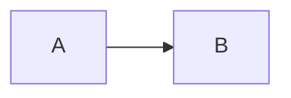

graph 以下にインデントで実際のグラフを表記する。
LR というのは 横方向のノードになり、

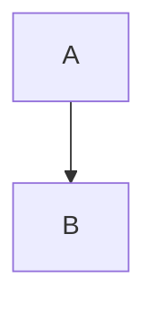

TB(Top to Bottom)とすると、縦方向のグラフになる。

## ノード形状

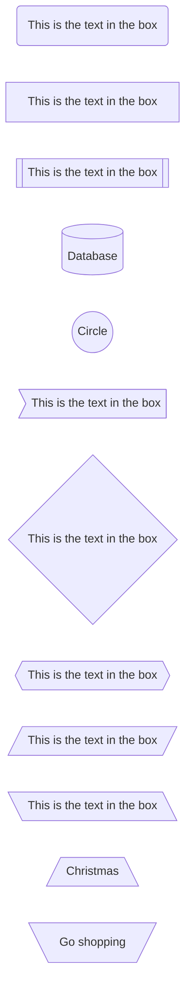

```
graph LR
    id1(This is the text in the box)
    id2[This is the text in the box]
    id3[[This is the text in the box]]
    id4[(Database)]
    id5((Circle))
    id6>This is the text in the box]
    id7{This is the text in the box}
    id8{{This is the text in the box}}
    id9[/This is the text in the box/]
    id10[\This is the text in the box\]
    id11[/Christmas\]
    id12[\Go shopping/]
```

ノード形状を指定したい場合は、ID[Text] や ID((Text)) のような
カギカッコの組み合わせによって指定できる。

## →の接続


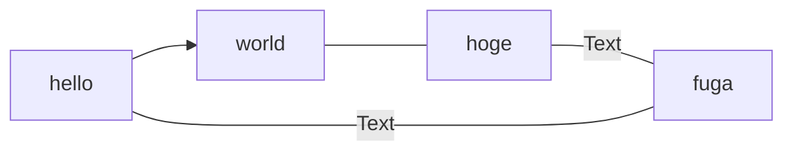

```
graph LR
    
    A[hello]
    B[world]
    C[hoge]
    D[fuga]
    
    A --> B
    B --- C
    C ---|Text| D
    D -- Text --- A
```

ノードの定義と→野定義は別に書くことができる。
→の間に文字を挟むには **NodeA ---|文字|NodeB** あるいは **NodeA -- Text --- NodeB** のようにする。

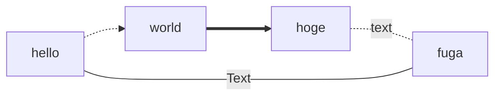

```
graph LR
    
    A[hello]
    B[world]
    C[hoge]
    D[fuga]
    
    A -.-> B
    B ==> C
    C -. text .-  D
    D -- Text --- A
```
矢印のスタイルは色々変えられる。

## Subgraph

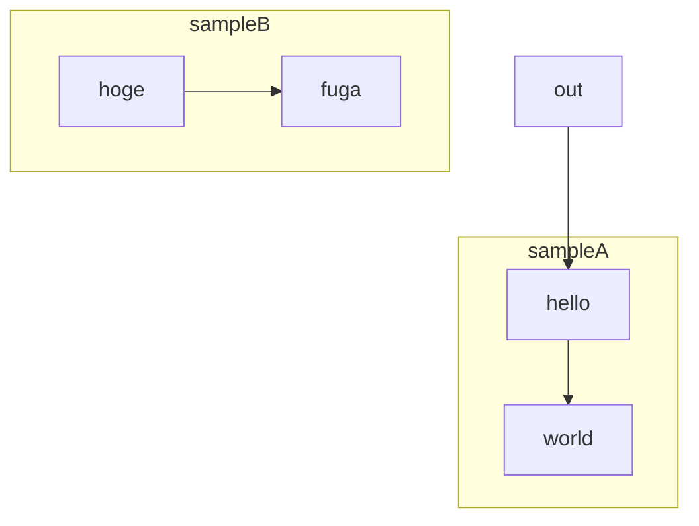

```
graph TB
    A[hello]
    B[world]
    C[hoge]
    D[fuga]
    OUT[out]
    
    OUT --> A
    subgraph sampleA
    A --> B
    end
    subgraph sampleB
    C --> D
    end
    
```

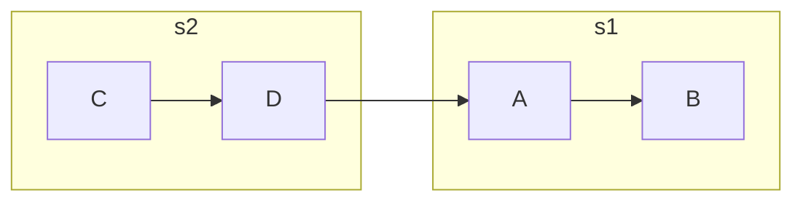

## 見た目の調整

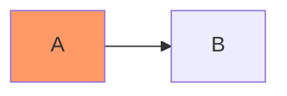

classDef name style で、見た目のスタイル定義ができる。

## 色々実験

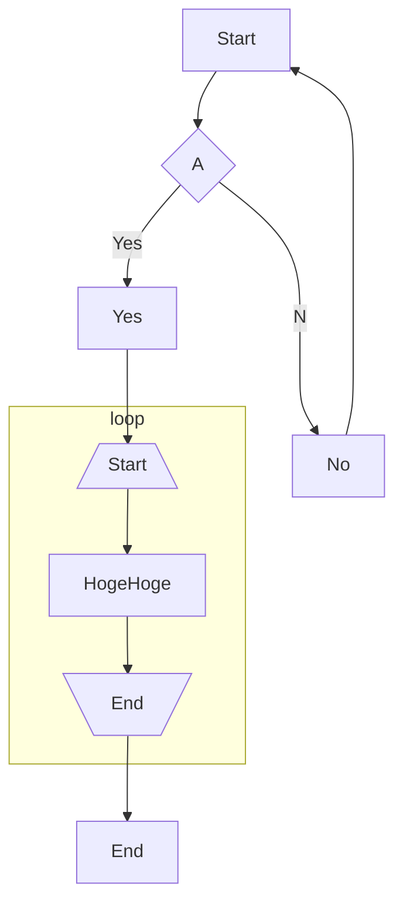

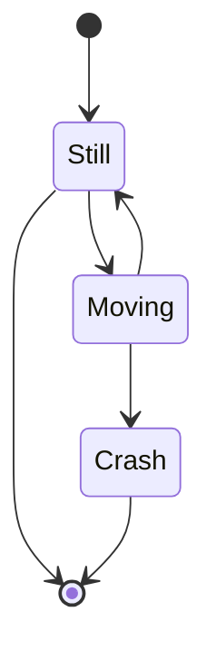

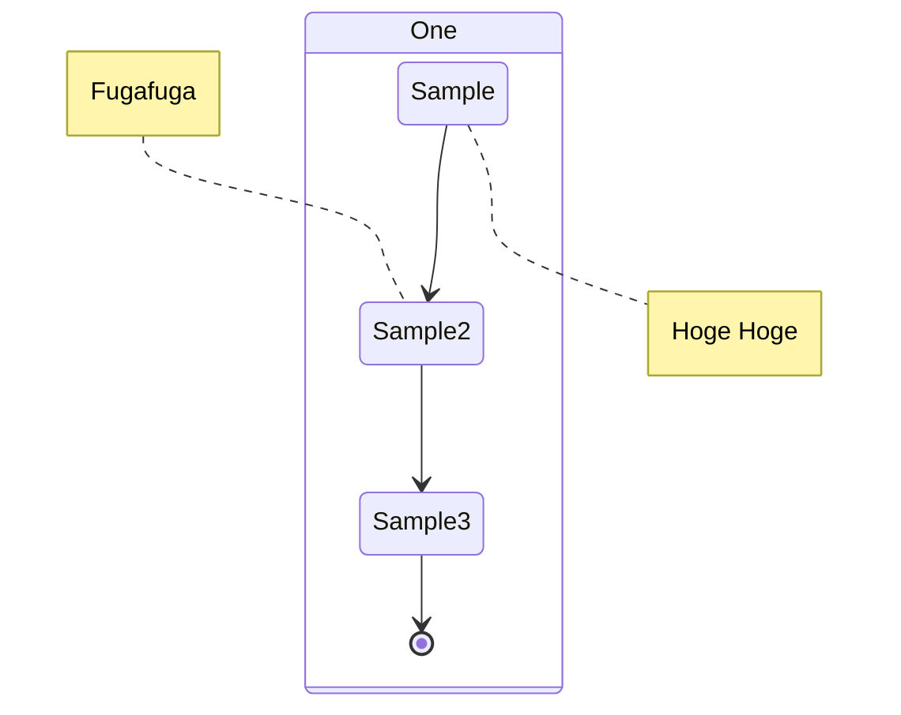
