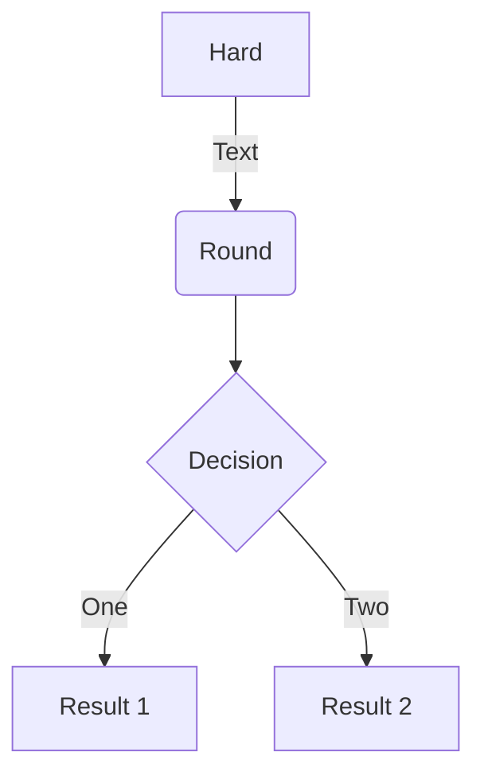

# mkdocs での Markdown 記載サンプル


!!! note "ほげほげ"
    テスト

!!! info
    いんふぉ

!!! tip
    tip

!!! success
    Success

!!! example
    Example
    

FootNote のテスト [^1]
    
### 画像

{{'icon.jpg'|img}}

### CodeSample

```python
from pxr import Usd, UsdGeom, Sdf, Gf, OrigSchema

stage = Usd.Stage.CreateInMemory()
hogePrim = OrigSchema.ConcreteBasePrim.Define(stage,'/hoge')
stage.GetRootLayer().Export("I:/test.usda")
```

blockdiag {
A -> B -> C -> D;
A -> E -> F -> G;
}

++ctrl+alt+delete++

:fa-external-link: [MkDocs](http://www.mkdocs.org/)


### icon

:smile:  
:fa-coffee:

:fish:
:frog:

### fontawesome

:fa-building:
:fa-android:
:fa-copy:
:fa-folder:
:fa-angle-double-right:

:fa-angle-right:

### fontstyle

==MARK TEST== hogehoge
~~sample~~

- [ ] test
- [ ] check2
- [ ] check3

1. A
2. B
3. C
   1. D
   2. E
      1. F
      2. G

| table | A   | B   | C   |
| ----- | --- | --- | --- |
| あ    | い  | う  | え  |

## マクロを作る

{{ 'https://twitter.com/fereria/status/1164544426967875584'|twitter }}
{{ fontstyle('hoge',1.5,'#00ff00') }}

{{'1484e59d53c93f7264a757961c9fa738'|gist}}

[^1]: 一番下に解説が追加される

{{fukidashi("ここに吹き出しの中の文字を入れると\n表示できる。")}}


{{'ほげほげ'|green_badge}} {{'ふがふが'|blue_badge}}

## ipynb

リポジトリ以下のipynbをロードしてmarkdownとして埋め込み

{{embedIpynb("notebooks/pythonBasic/hello_world__埋め込み用サンプル.ipynb")}}

一部だけ埋め込みたい場合
{{embedIpynb("notebooks/pythonBasic/hello_world__埋め込み用サンプル.ipynb",[1])}}

{--

* test remove
* test remove
* test remove
    * test remove
* test remove

--}

{++

* test add
* test add
* test add
    * test add
* test add

++}

{==some text==}



### drawioを指定して作図結果を表示


### includeマクロ

{{include("samplefile.py")}}
