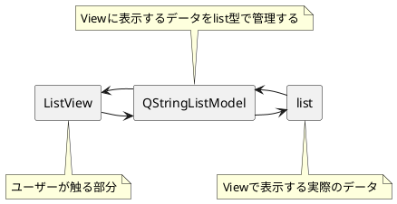

# 基本Widgetを使ってみる(4):ListView
<!-- SUMMARY:基本Widgetを使ってみる(4)_ListView -->

次は、これまたよく使うであろうListから指定の行を選択できる  
ListViewを説明していきたいと思います。  
  
!!! info
    コレと似たUIでListWidgetというものも存在していますが  
    そちらは、基本的には今回説明するListViewにModel（後で説明）が  
    含まれたWidgetになります。  
    そちらのほうが導入はしやすいですが、あえてListViewで説明していきます。

## サンプルコード

```python
#!python3
# -*- coding: utf-8 -*-

import sys
import os.path

from PySide2 import QtCore, QtGui, QtWidgets


class UISample(QtWidgets.QDialog):

    def __init__(self, parent=None):
        super(UISample, self).__init__(parent)
        # カスタムUIを作成
        layout = QtWidgets.QVBoxLayout()
        self.listView = QtWidgets.QListView()
        layout.addWidget(self.listView)
        self.lineEdit = QtWidgets.QLineEdit()
        layout.addWidget(self.lineEdit)
        label = QtWidgets.QLabel('↓に入力された文字の列を選択')
        layout.addWidget(label)
        self.lineEditB = QtWidgets.QLineEdit()
        layout.addWidget(self.lineEditB)
        self.setLayout(layout)
        # ここまでUI作成

        # Model作成
        self.model = QtCore.QStringListModel()
        self.model.setStringList(['aaa', 'bbb', 'ccc'])
        self.listView.setModel(self.model)
        
        # Signal-Slot作成
        self.lineEdit.returnPressed.connect(self.addList)
        self.listView.clicked.connect(self.listClicked)
        self.lineEditB.returnPressed.connect(self.matchSelect)
        
    def matchSelect(self):
        # Listから指定の文字の行を探して、見つかったら選択
        txt = self.lineEditB.text()
        stIndex = self.model.index(0, 0)
        searchIndex = self.model.match(stIndex, QtCore.Qt.DisplayRole, txt)
        if len(searchIndex) > 0:
            self.listView.setCurrentIndex(searchIndex[0])
        self.lineEditB.clear()

    def listClicked(self, index):
        # 現在選択している文字列を取得する
        print(index.data())

    def addList(self):

        txt = self.lineEdit.text()
        strList = self.model.stringList()
        strList.append(txt)
        self.model.setStringList(strList)
        self.lineEdit.clear()


if __name__ == '__main__':
    app = QtWidgets.QApplication(sys.argv)
    a = UISample()
    a.show()
    sys.exit(app.exec_())

```


実行すると、このようなGUIが表示されます。  
  
## Modelについて

まず、ListViewを使用する場合切手も切り離すことが出来ないのが「Model」  
と呼ばれるクラスになります。  

PySideには「Model-Viewアーキテクチャ」と呼ばれる構造があります。  
これは **データの管理部分と表示部分を別に管理しよう** という考え方になります。  
その辺は [DFTalk](https://dftalk.jp/?p=14388) にて紹介されているページがありますので  
そちらを参照してください。


ものすごい雑な解説図で説明すると  
今回説明する「ListView」というのは、「Listを表示する部分を受け持つUI」  
になっていて、実体自体は持ちません。  
そのため、デフォルトだとなにも表示されないし、表示する項目をセットする  
それっぽい関数なども存在しません。  
  
そのかわりに、実際のデータ管理部分を受け持っている「Model」クラスを作成して、  
こちら側でデータの管理を行うようにします。  
```python
        self.model = QtCore.QStringListModel()
        self.model.setStringList(['aaa', 'bbb', 'ccc'])
        self.listView.setModel(self.model)
```
今回のサンプルでは、この部分がModelを作成している部分になります。  
  
モデルはかなり色々とカスタマイズできますが、ソレをするとわけが分からなく  
なるので、今回は最もシンプルな「QStringListModel」を使用して  
基本的な動作を解説します。  
  
### QStringListModelとは

QStringListModelとは、list型のデータをViewに表示するためのModelになります。  
使い方は、上のサンプルのようにmodelオブジェクトを作成し、  
setStringListでstrのListをセットして、lisetViewに対してsetModelで  
登録すればOKです。  



構造的には↑のようになっていて、  
ユーザーが触る「表示部分（ListView)」と、データを管理する部分（QStringListModel）  
そして表側からは見えないですが、  
実際に表示するListをModelがアクセスして、  
ListをViewに表示しています。  
  
QStringListのHelpはこちらになりますが  
ここからはListの取得と登録のみできるようになっています。  
  
https://doc.qt.io/qtforpython/PySide2/QtCore/QStringListModel.html#qstringlistmodel  

## 具体的なよく使う関数

とりあえず今のところは「Modelというデータにアクセスする部分をセットするんだな」  
ぐらいの認識を持ちつつ、実際の使い方をみていきます。  
  
### Listに追加する


```python
    def addList(self):
 
        txt = self.lineEdit.text()
        strList = self.model.stringList()
        strList.append(txt)
        self.model.setStringList(strList)
        self.lineEdit.clear()
```

登録しているのはこの部分になります。  
QStringListModelの場合は、内部的にはlist型を持っているので、  
一度listを取り出して、新しく追加したい項目を append で追加して  
再度setStringListで登録してあげれば  
Listに新しい項目が追加することができます。  
  
### 現在選択している項目をstrで取得する

Listをクリックしたときに、現在選択している項目を取得したい場合は
```python
    def listClicked(self, index):
        # 現在選択している文字列を取得する
        print(index.data())
```
このようにします。  
clicked のSlotを設定すると、argsでindexを取得することができます。  
このindexは、現在選択されているデータにアクセスするためのタグのような  
ものになっています。  
https://doc.qt.io/qtforpython/PySide2/QtCore/QModelIndex.html#PySide2.QtCore.QModelIndex  
このindexはQModelIndexオブジェクトで、ここからデータを取得したい場合は
index.data() にアクセスすればOKです。  
  
スロットではなく、選択しているデータを取得したい場合は、
```python
index = self.listView.currentIndex()
```
これでindexを取得できるので、取得した後に index.data() で  
データを取得してくればOKです。  
  
### リストから指定の文字を探してきてMatchしたら選択  


  
```python
    def matchSelect(self):
        # Listから指定の文字の行を探して、見つかったら選択
        txt = self.lineEditB.text()
        stIndex = self.model.index(0, 0)
        searchIndex = self.model.match(stIndex, QtCore.Qt.DisplayRole, txt)
        if len(searchIndex) > 0:
            self.listView.setCurrentIndex(searchIndex[0])
        self.lineEditB.clear()
```
Listから指定の文字でindexを探したい場合は matchを使用します。  
これは若干使い方がわかりにくいですが、  


まず、どこから探すかの起点になるIndexを作成し（この場合一番上が row=0 column=0)  
どの文字列と比較するかを指定（UIに表示されている内容なら QtCore.Qt.DisplayRole )  
最後にmatchさせたい文字を指定します。  
  
!!! info
    QtCore.Qt.DisplayRoleは、Modelカスタマイズの際にもう少し詳しく説明します。  
    ここでは「Modelからなにを取得したいかのフラグ」と思えばOKです。

matchを使わない方法としては

```python
    def matchString(self):
        strList = self.model.stringList()
        txt = self.lineEditB.text()
        if txt in strList:
            index = self.model.index(strList.index(txt), 0)
            self.listView.setCurrentIndex(index)
```
list.index('moji')  
を使用することでlist型のどこに指定の文字が入っているかを数字で取得して  
index(row,column) のrowにその数字を入れてIndexを取得してきてから  
setCurrentIndexするやり方もできます。  
こちらの場合は文字が完全に一致している場合に有効で  
matchの場合は1文字でもあっていれば  
選択をすることができるようになります。  
  
## まとめ

基本を押さえたつもりですがわかりにくいかもしれませんorz  
ListViewに限らずView周りはPySideのなかでもかなり奥が深い分野になるので  
もうしばらく何回かに分けて解説をして行ければと思います。  
  
が、難しい！  

