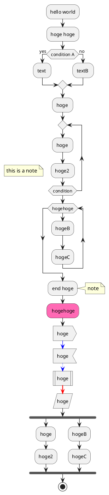

# Markdownの書き方サンプル

1. aaa
2. bbb

----

```python
print "hello World"
```

```
pip install mkdocs
```

!!! Warning
    わーにん！わーにん！
    
!!! Note
    これはノートです。    


++ctrl+alt+delete++

:fa-external-link: [MkDocs](http://www.mkdocs.org/)

:smile:  
:fa-coffee:

==MARK TEST== hogehoge  


## 参考
  
  * https://qiita.com/mebiusbox2/items/a61d42878266af969e3c


```plantuml format="png" classes="uml myDiagram" alt="My super diagram placeholder" title="My super diagram" width="300px" height="300px"

@startuml

up -up-> right
-right-> down
-down-> left
-left-> up

@enduml  
```




{{color(red)::some_text}}  
{{color(blue)::some_text}}

