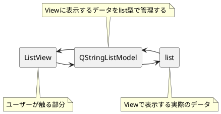

# 基本 Widget を使ってみる(4):ListView

次は、これまたよく使うであろう List から指定の行を選択できる  
ListView を説明していきたいと思います。

:::info
コレと似た UI で ListWidget というものも存在していますが
そちらは、基本的には今回説明する ListView に Model（後で説明）が
含まれた Widget になります。
そちらのほうが導入はしやすいですが、あえて ListView で説明していきます。
:::

## サンプルコード

```python
#!python3
# -*- coding: utf-8 -*-

import sys
import os.path

from PySide2 import QtCore, QtGui, QtWidgets


class UISample(QtWidgets.QDialog):

    def __init__(self, parent=None):
        super(UISample, self).__init__(parent)
        # カスタムUIを作成
        layout = QtWidgets.QVBoxLayout()
        self.listView = QtWidgets.QListView()
        layout.addWidget(self.listView)
        self.lineEdit = QtWidgets.QLineEdit()
        layout.addWidget(self.lineEdit)
        label = QtWidgets.QLabel('↓に入力された文字の列を選択')
        layout.addWidget(label)
        self.lineEditB = QtWidgets.QLineEdit()
        layout.addWidget(self.lineEditB)
        self.setLayout(layout)
        # ここまでUI作成

        # Model作成
        self.model = QtCore.QStringListModel()
        self.model.setStringList(['aaa', 'bbb', 'ccc'])
        self.listView.setModel(self.model)

        # Signal-Slot作成
        self.lineEdit.returnPressed.connect(self.addList)
        self.listView.clicked.connect(self.listClicked)
        self.lineEditB.returnPressed.connect(self.matchSelect)

    def matchSelect(self):
        # Listから指定の文字の行を探して、見つかったら選択
        txt = self.lineEditB.text()
        stIndex = self.model.index(0, 0)
        searchIndex = self.model.match(stIndex, QtCore.Qt.DisplayRole, txt)
        if len(searchIndex) > 0:
            self.listView.setCurrentIndex(searchIndex[0])
        self.lineEditB.clear()

    def listClicked(self, index):
        # 現在選択している文字列を取得する
        print(index.data())

    def addList(self):

        txt = self.lineEdit.text()
        strList = self.model.stringList()
        strList.append(txt)
        self.model.setStringList(strList)
        self.lineEdit.clear()


if __name__ == '__main__':
    app = QtWidgets.QApplication(sys.argv)
    a = UISample()
    a.show()
    sys.exit(app.exec_())

```


実行すると、このような GUI が表示されます。

## Model について

まず、ListView を使用する場合切手も切り離すことが出来ないのが「Model」  
と呼ばれるクラスになります。

PySide には「Model-View アーキテクチャ」と呼ばれる構造があります。  
これは **データの管理部分と表示部分を別に管理しよう** という考え方になります。  
その辺は [DFTalk](https://dftalk.jp/?p=14388) にて紹介されているページがありますので  
そちらを参照してください。


ものすごい雑な解説図で説明すると  
今回説明する「ListView」というのは、「List を表示する部分を受け持つ UI」  
になっていて、実体自体は持ちません。  
そのため、デフォルトだとなにも表示されないし、表示する項目をセットする  
それっぽい関数なども存在しません。

そのかわりに、実際のデータ管理部分を受け持っている「Model」クラスを作成して、  
こちら側でデータの管理を行うようにします。

```python
        self.model = QtCore.QStringListModel()
        self.model.setStringList(['aaa', 'bbb', 'ccc'])
        self.listView.setModel(self.model)
```

今回のサンプルでは、この部分が Model を作成している部分になります。

モデルはかなり色々とカスタマイズできますが、ソレをするとわけが分からなく  
なるので、今回は最もシンプルな「QStringListModel」を使用して  
基本的な動作を解説します。

### QStringListModel とは

QStringListModel とは、list 型のデータを View に表示するための Model になります。  
使い方は、上のサンプルのように model オブジェクトを作成し、  
setStringList で str の List をセットして、lisetView に対して setModel で  
登録すれば OK です。



構造的には ↑ のようになっていて、  
ユーザーが触る「表示部分（ListView)」と、データを管理する部分（QStringListModel）  
そして表側からは見えないですが、  
実際に表示する List を Model がアクセスして、  
List を View に表示しています。

QStringList の Help はこちらになりますが  
ここからは List の取得と登録のみできるようになっています。

https://doc.qt.io/qtforpython/PySide2/QtCore/QStringListModel.html#qstringlistmodel

## 具体的なよく使う関数

とりあえず今のところは「Model というデータにアクセスする部分をセットするんだな」  
ぐらいの認識を持ちつつ、実際の使い方をみていきます。

### List に追加する


```python
    def addList(self):

        txt = self.lineEdit.text()
        strList = self.model.stringList()
        strList.append(txt)
        self.model.setStringList(strList)
        self.lineEdit.clear()
```

登録しているのはこの部分になります。  
QStringListModel の場合は、内部的には list 型を持っているので、  
一度 list を取り出して、新しく追加したい項目を append で追加して  
再度 setStringList で登録してあげれば  
List に新しい項目が追加することができます。

### 現在選択している項目を str で取得する

List をクリックしたときに、現在選択している項目を取得したい場合は

```python
    def listClicked(self, index):
        # 現在選択している文字列を取得する
        print(index.data())
```

このようにします。  
clicked の Slot を設定すると、args で index を取得することができます。  
この index は、現在選択されているデータにアクセスするためのタグのような  
ものになっています。  
https://doc.qt.io/qtforpython/PySide2/QtCore/QModelIndex.html#PySide2.QtCore.QModelIndex  
この index は QModelIndex オブジェクトで、ここからデータを取得したい場合は
index.data() にアクセスすれば OK です。

スロットではなく、選択しているデータを取得したい場合は、

```python
index = self.listView.currentIndex()
```

これで index を取得できるので、取得した後に index.data() で  
データを取得してくれば OK です。

### リストから指定の文字を探してきて Match したら選択


```python
    def matchSelect(self):
        # Listから指定の文字の行を探して、見つかったら選択
        txt = self.lineEditB.text()
        stIndex = self.model.index(0, 0)
        searchIndex = self.model.match(stIndex, QtCore.Qt.DisplayRole, txt)
        if len(searchIndex) > 0:
            self.listView.setCurrentIndex(searchIndex[0])
        self.lineEditB.clear()
```

List から指定の文字で index を探したい場合は match を使用します。  
これは若干使い方がわかりにくいですが、


まず、どこから探すかの起点になる Index を作成し（この場合一番上が row=0 column=0)  
どの文字列と比較するかを指定（UI に表示されている内容なら QtCore.Qt.DisplayRole )  
最後に match させたい文字を指定します。

!!! info
QtCore.Qt.DisplayRole は、Model カスタマイズの際にもう少し詳しく説明します。  
 ここでは「Model からなにを取得したいかのフラグ」と思えば OK です。

match を使わない方法としては

```python
    def matchString(self):
        strList = self.model.stringList()
        txt = self.lineEditB.text()
        if txt in strList:
            index = self.model.index(strList.index(txt), 0)
            self.listView.setCurrentIndex(index)
```

list.index('moji')  
を使用することで list 型のどこに指定の文字が入っているかを数字で取得して  
index(row,column) の row にその数字を入れて Index を取得してきてから  
setCurrentIndex するやり方もできます。  
こちらの場合は文字が完全に一致している場合に有効で  
match の場合は 1 文字でもあっていれば  
選択をすることができるようになります。

## まとめ

基本を押さえたつもりですがわかりにくいかもしれません orz  
ListView に限らず View 周りは PySide のなかでもかなり奥が深い分野になるので  
もうしばらく何回かに分けて解説をして行ければと思います。

が、難しい！
